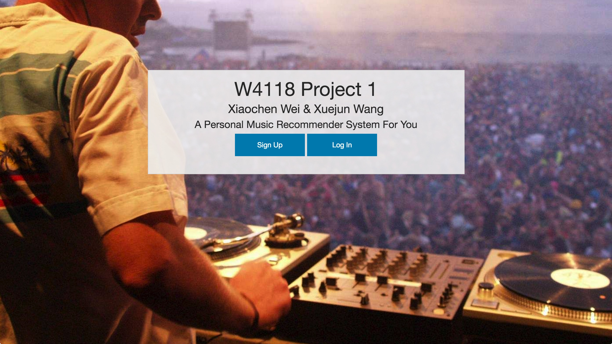

### Pre-requirement

To run the web application, your need to install the following modules.

> Flask
> requests

### How to run the code

The running process is very simple:

> python app.py

Then you can visit localhost:5000 to get to the homepage.

### Screenshots

